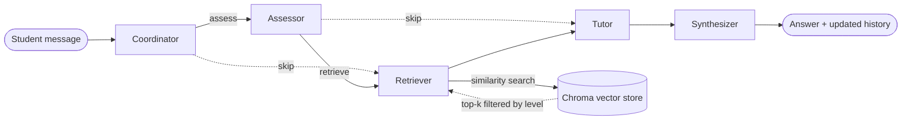

# VectorMentor

**A multi-agent RAG tutor for linear algebra.** Specialized LLM agents, orchestrated as a LangGraph state machine, assess the student's level, retrieve matching material from a Chroma vector store and explain it at that level in a Streamlit chat.


> The tutor converses in Spanish. Its knowledge base covers vectors, dot products, matrices, determinants, systems of linear equations, vector spaces and graded exercises.
> *El tutor conversa en español.*

## How it works

Every student message runs through a typed LangGraph `StateGraph`:



| Step | Responsibility | Temperature |
|---|---|---|
| **Coordinator** | Classifies the message (definition, procedure, examples, calculation, question) and builds context from the conversation history and the student's progress | 0.7 |
| **Assessor** | Estimates the student's level on a 1–5 scale and flags knowledge gaps | 0.3 |
| **Retriever** | Pulls the most relevant passages from the vector store, filtered to the student's level or below | 0.1 |
| **Tutor** | Writes the explanation, worked examples and practice exercises for that level | 0.8 |
| **Synthesizer** | Merges the agents' outputs into the final answer and records the turn in the history | — |

Temperatures are set per agent on purpose: low where the task should be repeatable (retrieval, assessment) and higher where the tutor benefits from varied explanations.

## Features

- **Level-aware retrieval.** Every document carries `topic`, `subtopic` and `level` metadata, so the retriever only returns material at or below the student's assessed level.
- **Math-friendly chat.** The Streamlit interface cleans up the model's LaTeX and renders formulas with `st.latex`.
- **Practice mode.** The tutor generates exercises matched to the student's level and gives feedback on answers.
- **Web or console.** `python main.py` starts the Streamlit app; `python main.py --cli` runs a terminal session.

## Tech stack

Python 3.11 · LangGraph · LangChain · OpenAI (`gpt-4o-mini`, `text-embedding-3-small`) · Chroma · Streamlit · Loguru

## Getting started

Requirements: Python 3.11 (recommended) and an OpenAI API key.

```bash
git clone https://github.com/luismeza5/Vector_Mentor.git
cd Vector_Mentor
python -m venv venv
source venv/bin/activate          # Windows: venv\Scripts\activate
pip install -r requirements.txt
```

Create a `.env` file in the project root:

```bash
OPENAI_API_KEY=your_key_here
```

> On Windows PowerShell 5, `echo ... > .env` saves the file as UTF-16, which `python-dotenv` can't read. Create it with your editor or run `Set-Content .env "OPENAI_API_KEY=your_key_here" -Encoding utf8`.

Run it:

```bash
python main.py          # web app on http://localhost:8501
python main.py --cli    # console mode
```

## Configuration

Main settings live in `config/settings.py`:

| Setting | Default | Purpose |
|---|---|---|
| `LLM_MODEL` | `gpt-4o-mini` | Chat model used by every agent |
| `EMBEDDING_MODEL` | `text-embedding-3-small` | Embeddings for the vector store |
| `RETRIEVAL_TOP_K` | `5` | Passages retrieved per question |
| `SIMILARITY_THRESHOLD` | `0.7` | Minimum similarity for a passage |
| `CHROMA_PERSIST_DIRECTORY` | `./chroma_db` | Where the vector store is persisted |

Each agent's temperature, token limit and system prompt are in `AGENT_CONFIGS` in the same file.

## Project structure

```
Vector_Mentor/
├── main.py                     # Entry point: web (Streamlit) or --cli
├── config/settings.py          # Models, RAG parameters, per-agent configs
├── agents/                     # BaseAgent + coordinator, assessor, retriever, tutor
├── workflow/langgraph_flow.py  # LangGraph state machine and routing
├── rag/
│   ├── vector_store.py         # Chroma manager, level-filtered search
│   ├── embeddings.py
│   ├── retrieval.py
│   └── hybrid_store.py         # Experimental: keyword fallback without embeddings
├── knowledge_base/
│   ├── content_loader.py       # Knowledge base documents with topic/level metadata
│   └── data/                   # Reference texts and exercises by level
├── interface/streamlit_app.py  # Chat UI, LaTeX rendering, practice mode
├── utils/                      # Logging, math formatting helpers
└── tests/                      # Smoke-test scripts per layer
```

## Tests

`tests/` contains smoke-test scripts that exercise each layer. They call the OpenAI API, so set your key first:

```bash
python tests/test_agents.py     # imports and agent configuration
python tests/test_rag.py        # vector store and retrieval
python tests/test_hybrid.py     # hybrid store fallback
python tests/test_workflow.py   # a full multi-agent turn
```

Logs are written to `logs/eduamentor.log` (rotated daily, kept for 7 days).

## Next steps

- Let the coordinator skip assessment or retrieval on follow-up turns. The graph already has the conditional edges; the coordinator currently always takes the full path.
- Load the texts in `knowledge_base/data/` into the vector store (the loader currently uses the documents defined in `content_loader.py`).
- Turn the smoke scripts into pytest tests with a mocked LLM and run them in GitHub Actions.
- Build a small evaluation set of student questions to measure answer quality per level.

## Author

**Luis Ángel Meza Chavarría** · [github.com/luismeza5](https://github.com/luismeza5)

## License

Released under the [MIT License](LICENSE).
